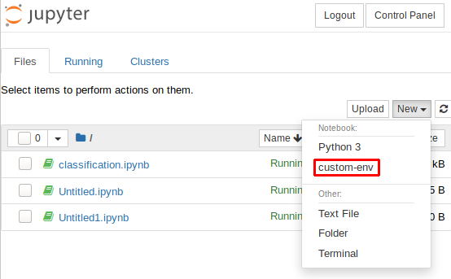

# JupyterHubユーザマニュアル
このマニュアルはAIコンソーシアムにおける計算資源運用によるJupyterHubの試験運用の利用者のためのマニュアルです。

不明点・要望・トラブル等についてはSlackの`#server`チャンネルか`hai-help-group@keio.jp`までご連絡ください。

## 申請
JupyterHubへのアクセスはLDAP認証を用いているため、まずLDAPアカウントの作成が必要です。利用するにあたってSlackのDMで`mtakeda`に利用したい旨と名前のローマ字表記を伝えて下さい。アカウントを作成し、ユーザ名・パスワードをお伝えします。

## アクセス手順
認証の都合でJupyterHubのページに直接アクセスする前に一度だけSSH経由でのアクセスが必要になっています。一度アクセスを行うとユーザの設定が完了するので以降は直接URLにアクセスしログインすれば問題ありません。以下のコマンドを用いて、申請の際に伝えられたパスワードを入力しゲートウェイにログインを行って下さい。

```
ssh -p 2221 [ユーザ名]@cocoa.ai.hc.keio.ac.jp
```

ログインが完了するとパスワードを変更するよう促されるので、パスワードを変更した後そこからもう一度SSHを行いJupyterHubのサーバにアクセスします。新しく設定したパスワードを用いてログインを行うことができます。

```
ssh [ユーザ名]@jupyterhub-container-test.lxd
```

これで正常にログインができれば設定は完了です。接続を切り、ブラウザで [https://cocoa.ai.hc.keio.ac.jp](https://cocoa.ai.hc.keio.ac.jp) にアクセスしてください。ここで、`https`ではなく`http`と打ってしまうと正しくアクセスできないので注意して下さい。出てきたログインフォームにてユーザ名と新しく設定したパスワードを入力すればログインができるはずです。

## 注意
こちらのJupyterHubインスタンスはまだ試験運用中なので突然落ちたりする可能性もあります。突然アクセスできなくなった、等の問題があれば速やかにご連絡下さい。

## カスタムパッケージ追加の方法
condaやpipのパッケージを入れようとしても、パーミッション関係のエラーが出てきます。そこで、次のようにするとcondaやpipで独自のパッケージを自由にインストールできるようになります。まず、SSHやJupyter Notebookのターミナル等でシェルを得た後、condaの初期設定を次のコマンドで行います。

```sh
conda init bash
source ~/.bashrc
```

次に、自分用のcondaのenvironmentの作成を行い、Jupyterにインストールします。

```sh
conda create -n custom-env --clone base
conda activate custom-env
ipython kernel install --user --name custom-env
```

新しく作ったenvironmentでは自由にパッケージをインストールすることができ、Jupyter Notebookを起動するタイミングで以下のようにcustom-envを選択すればインストールしたパッケージを利用することができます。



参考: <https://zonca.github.io/2017/02/customize-python-environment-jupyterhub.html>
