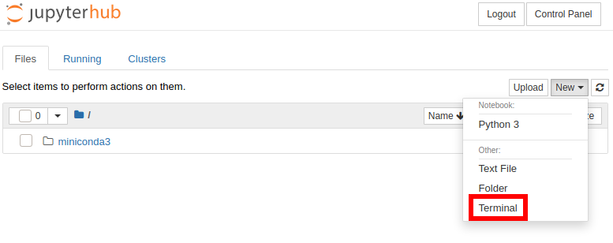
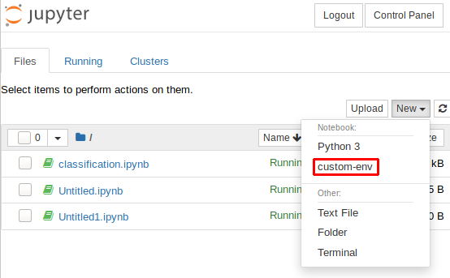
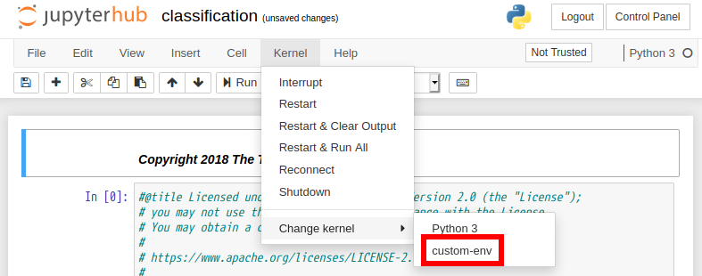

# JupyterHub ユーザマニュアル

このマニュアルは AI コンソーシアムの JupyterHub サービスの利用者のためのマニュアルです。

不明点・要望・トラブル等については `aic-server-group@keio.jp` までご連絡ください。

## 申請

JupyterHub へのアクセスは LDAP 認証を用いているため、まず LDAP アカウントの作成が必要です。[ホームページ](https://aic.keio.ac.jp/events/jupyterhub)から申請を行ってください。申請が通り次第、ユーザ名・パスワードが送付されます。

ユーザ名・パスワードの送付までは 2 日程度かかることがあります。あらかじめご了承ください。

## アクセス手順

アカウントが発行されたら、まず初期パスワードを変更してください。
変更方法は Web 経由と SSH 経由の 2 通りがあります。

変更後はブラウザで JupyterHub ( [https://cocoa.ai.hc.keio.ac.jp](https://cocoa.ai.hc.keio.ac.jp) ) にアクセスしてください。ここで、`https`ではなく`http`と打ってしまうと正しくアクセスできないので注意してください。出てきたログインフォームにてユーザ名と新しく設定したパスワードを入力するとログインができます。**初回のログイン時は 30 秒から数分程度の時間が掛かる場合があります。ご了承下さい。**エラーが出てしまった場合は一旦ページを再読込してください。

### 1. Web 経由で変更する場合

Web 経由で変更する場合は [https://user.keioaic.dev](https://user.keioaic.dev) にアクセスしてください。
発行されたユーザ名と初期パスワードを入力してログインを行うとパスワード変更用のフォームに遷移しますので、パスワードを変更してください。
変更が反映された旨のメッセージが表示されたらパスワード変更は完了です。

### 2. SSH 経由で変更する場合

SSH 接続では

- Windows 10 の場合: コマンドプロンプトまたは PowerShell で OpenSSH が使用できます。
  - [こちら](https://docs.microsoft.com/ja-jp/windows-server/administration/openssh/openssh_install_firstuse)に記載されている手順に従って OpenSSH クライアントをインストールする必要があります。
- Windows 10 以前の場合: Tera Term や PuTTY 等の SSH クライアントソフトウェアを使用してください。
- macOS (OS X) / Linux の場合: ターミナル上で OpenSSH が使用できます。

OpenSSH 以外の各種 SSH クライアントソフトウェアを使用する場合は、それぞれのドキュメントを参考にしてください。個別のソフトウェアに対するサポートは致しかねます。ご了承ください。

以下のコマンドを用いて、申請の際に伝えられたユーザ名と初期パスワードを入力しゲートウェイにログインを行ってください。

```
ssh -p 2221 [ユーザ名]@[ゲートウェイサーバ].ai.hc.keio.ac.jp
```

ゲートウェイサーバは tippy、chino、cocoa、rize のうちから選んでください。どれにログインしても違いはありません。また、どのゲートウェイサーバに接続したかを覚えておく必要はありません。以下は例です。

```
ssh -p 2221 user@tippy.ai.hc.keio.ac.jp
```

SSH クライアントソフトウェアを使用する場合は、接続先のポートを 2221 番に設定してください。

ログインが完了するとパスワードを変更するよう促されるので、パスワードを変更します。
再び同じ場所に SSH 接続を行い、正常にログインができれば設定は完了です。

**こちらのゲートウェイサーバでは作業をしないでください．**
セキュリティのためリソースを厳しく制限しており、大容量のデータ保存や重いワークロードの実行があるとサーバがダウンするようになっています。これはパスワードの漏れ等により万が一侵入された場合を考慮しての措置です。作業は各個人の JupyterHub インスタンス内で行っていただくようお願いします。

また Visual Studio Code (以下 VSCode) の Remote SSH 拡張機能を使ってのアクセスも、大容量のアプリケーションがサーバ側に保存されてしまうためご遠慮ください。JupyterHub インスタンスに直接アクセスしていただく上でご利用されるのは問題ありません。JupyterHub インスタンスへ直接 SSH を行う方法については[こちら](#jupyter-notebook-インスタンスへの-ssh-アクセスの仕方)で案内します。

## カスタムパッケージ追加の方法

conda や pip のパッケージを入れようとしても、そのままでは JupyterHub から利用できる状態にはなりません。そこで、次のようにすると conda や pip で独自のパッケージを自由にインストールできるようになります。まずは、JupyterHub にログインし、「New」→「Terminal」をクリックしターミナルを起動します。




ターミナルで次のコマンドを実行し、自分用の conda の environment の作成し、Jupyter Notebook が認識するようにインストールします。今回は`custom-env`という名前で作成しますが、好きな名前で作ることもできます。

```sh
conda create -n custom-env --clone base
conda activate custom-env
conda install anaconda
ipython kernel install --user --name custom-env
```

上のように、`base`をベースの environment として使用する場合は必ず`conda install anaconda`を実行してください。`ipython`パッケージを単体でインストールすると`ipython kernel`がうまく動かないことがあります。

また、ベースとなる environment には`base`の他に`jupyterhub-env`も使えます。この場合は`anaconda`パッケージのインストールは必須ではありませんが、他のパッケージをインストールする際に依存関係の解決で非常に時間がかかることがあります。基本的には`base`を使用することを推奨します。

新しく作った environment には`conda install [パッケージ名]`で自由にパッケージをインストールすることができ、Jupyter Notebook を起動するタイミングで以下のように custom-env を選択すればインストールしたパッケージを利用することができます。



上で作成した`custom-env`を削除したい場合には Ternimal で以下を実行します。

```sh
conda activate base # base environmentに切替
conda remove -n custom-env --all # custom-env envrionmentを削除
jupyter kernelspec uninstall custom-env # Jupyter Notebookの起動時の選択肢からcustom-envを削除
```

なお、`base`と`jupyterhub-env`の environment は削除しないでください。削除してしまうと Jupyter Notebook インスタンスが正常に動作しなくなる可能性があります。

参考: <https://zonca.github.io/2017/02/customize-python-environment-jupyterhub.html>

## GPU を用いた機械学習の手順例

GPU ドライバや CUDA は既にインストールされた状態になっているため、GPU を用いた機械学習を行うには conda 等によって必要なパッケージのインストールを行えばできるようになります。ここでは TensorFlow という機械学習のフレームワークを用いたチュートリアルを実行する手順を例としてとりあげます。[カスタムパッケージ追加の方法](#カスタムパッケージ追加の方法)と同様にターミナルを開きましょう。

上で作成した`custom-env`を使いましょう。別な名前で作成した場合は、適宜読み替えてください。

```
conda activate custom-env
conda install tensorflow-gpu
wget 'https://raw.githubusercontent.com/tensorflow/docs/master/site/en/tutorials/keras/classification.ipynb' # Tensorflowのチュートリアル用ipynbファイル
```

JupyterHub のアイコンをクリックしファイル一覧に戻り、新しくダウンロードした`classification.ipynb`をクリックし開きます。「Kernel」→「Change kernel」をクリックし、`custom-env`を選択します。



最後に、１つ１つのセルを実行すればチュートリアルに沿って実行を進めることができます。

## データのバックアップについて

JupyterHub 上で使用しているデータ等については、ご自身でのバックアップをお願いいたします。
バックアップ方法としては

- sftp, rsync 等でご自身の PC にバックアップをとる
- rclone 等のツールを使ってクラウドストレージ上にバックアップをとる

といった方法があります。
keio.jp のアカウントでは Box が容量無制限で使えるため、rclone でご自身の Box と連携してしまうのが最も手っ取り早いと思われます。
rclone の詳細については、[公式ドキュメント](https://rclone.org/)をご覧ください。
（個別のツールについての質問はお答えできません。ご了承ください。）

## JupyterHub インスタンスに直接アクセスしたい場合

ここでは、JupyterHub の Web インターフェイスを介さず、ご自身のインスタンスに直接アクセスする方法を説明します。

あらかじめインスタンスが起動している必要があります。インスタンスはユーザが JupyterHub にログインしたタイミングで立ち上がるようになっているため、接続できない場合は JupyterHub にブラウザからログインしてください。なおも立ち上がらない場合は`Start My Server`をクリックしてください。

### ポートフォワーディングの仕方

Jupyter Notebook インスタンスの利用の上で、TensorBoard の利用やウェブアプリケーションの開発等によりどこかのポートにアクセスしたい場合は次のようにポートフォワーディングを行うことができます。例えば、8000 番ポートにアクセスをしたい場合は、次のようなコマンドを実行します。

```
ssh -p 2221 -L 8000:jupyterhub-singleuser-instance-[ユーザ名].lxd:8000 [ユーザ名]@[ゲートウェイサーバ].ai.hc.keio.ac.jp
```

この時、ユーザ名とゲートウェイサーバは[アクセス手順](#2-ssh-経由で変更する場合)と同様に設定します。すると、SSH 接続が維持されている限り`locahost:8000`へのアクセスは透過的に Jupyter Notebook インスタンスの 8000 番ポートに転送されるようになります。

### Jupyter Notebook インスタンスへの SSH アクセスの仕方

Jupyter Notebook インスタンスに直接 SSH 接続をしたい場合は、公開鍵認証を使用することでアクセスできるようになります。

事前の準備として

- SSH キーペアの生成
- 接続元の端末での`ssh-agent`の起動、SSH キーペアの登録
- Jupyter Notebook インスタンスへの SSH 公開鍵の登録
  - `~/.ssh/authorized_keys`に書き込む、`ssh-import-id-gh [GitHubユーザ名]`でインポートする等
- (任意) ゲートウェイサーバへの SSH 公開鍵の登録
  - これを行うことでゲートウェイコンテナでも公開鍵認証で SSH 接続できるようになります
  - 各ゲートウェイサーバ間でホームディレクトリは同期しませんのでご注意ください

が必要になります。具体的な手順等についてはインターネット上の各種ドキュメントを参考にしてください。(参考: [GitHub 公式ドキュメント](https://docs.github.com/ja/authentication/connecting-to-github-with-ssh/generating-a-new-ssh-key-and-adding-it-to-the-ssh-agent) )

実際に接続する際には、まず

```
ssh -p 2221 -A [ユーザ名]@[ゲートウェイサーバ].ai.hc.keio.ac.jp
```

でゲートウェイサーバに SSH 接続します。

`-A`は agent forwarding を行うオプションです。OpenSSH 以外の各種 SSH クライアントソフトウェアを使用する場合は`Forward agent`オプションを有効にしてください。

次に

```
ssh ubuntu@jupyterhub-singleuser-instance-[ユーザ名].lxd
```

を実行することで、JupyterHub 上のターミナルを使わなくてもご自身の PC のターミナルから直接コマンドが実行できるようになります。

以下のような設定をご自身の PC の `~/.ssh/config` に設定しておくと、上記の内容と同じ接続手順が接続元のターミナルで `ssh jupyterhub` と入力するだけで行えるようになりスムーズです。 

```
Host gateway
    HostName [ゲートウェイサーバ].ai.hc.keio.ac.jp
    User [ユーザ名]
    Port 2221
    IdentityFile [秘密鍵のファイルパス（例: ~/.ssh/id_ed25519）]
    IdentitiesOnly yes
    ForwardAgent yes

Host jupyterhub
    HostName jupyterhub-singleuser-instance-[ユーザ名].lxd
    User ubuntu
    Port 22
    ProxyJump gateway
```

この設定を使えば、VSCode の Remote SSH を利用して JupyterHub インスタンスに直接接続することも可能になります。このとき、ゲートウェイサーバを経由する関係で接続には通常よりも時間がかかりますので、VSCode側 の設定で`remote.SSH.connectTimeout`を長めにとっていただくことをおすすめします。

## CUDA バージョンの変更について

使用するライブラリやソフトウェアによっては、インストールされている CUDA バージョンに対応していない場合があります。本サービスでは、ユーザ自身による CUDA のバージョン変更に対応しています。

ただし CUDA のバージョン変更は**Jupyter Notebook インスタンスのバージョンによって手順が異なります**。

次のコマンドの出力により CUDA バージョンの変更の手順がわかります:

```
apt list --installed | grep cuda-repo
```

もし、次のような出力が得られた場合はサーバ管理者による対応が必要となるため、お手数ですが `aic-server-group@keio.jp` までご連絡ください:

```
WARNING: apt does not have a stable CLI interface. Use with caution in scripts.

cuda-repo-ubuntu1804/unknown,now 10.2.89-1 amd64 [installed]
```

一方、次のような出力が得られた場合は次の手順に進んでください。

```
WARNING: apt does not have a stable CLI interface. Use with caution in scripts.
```

次のコマンドで現在の CUDA のバージョンを確認することができます。

```
apt list --installed | grep ^cuda-toolkit
```

例えば、CUDA 10.1（`cuda-toolkit-10-1`）がインストールされており、CUDA 10.2 にアップグレードしたいとします。その場合、次のように一旦現在の CUDA ツールキットを削除した後に新たな CUDA ツールキットをインストールします。

```
sudo apt remove --purge --yes cuda-toolkit-10-1
sudo apt autoremove --purge --yes
sudo apt install --yes cuda-toolkit-10-2
```

なお、インストールが可能な CUDA バージョンの一覧は次のコマンドで確認することができます。

```
sudo apt search ^cuda-toolkit
```

必ず`cuda-toolkit`パッケージをインストールするようにしてください。`cuda`パッケージのインストールは実行すると失敗し、`apt`パッケージマネージャでは修復ができなくなります。

## 制約等

### リソース

現在、各ユーザには

- CPU: 仮想 2 コア (共有)
- メモリ: 8GB (共有)
- ストレージ: 100GB
- GPU: RTX 2080 Ti x 1

が割り当てられています。GPU の利用を主な用途として想定しており、CPU・メモリを酷使する用途は想定しておりません。

利用者数に応じて、将来的に GPU・CPU・メモリ・ストレージ等の制約を設ける可能性があります。ご了承ください。

### 他のユーザが GPU を利用している場合

各ユーザのインスタンスは他のユーザのインスタンスと GPU を共有しています。

時には他のユーザがプロセスを走らせているため、GPU を利用できない場合があります。

このような場合、Control Panel から Stop My Server のボタンを押して頂き、その後サーバを再起動させることで他の空いている GPU を自動で取得することが可能です。

### ユーザ環境のシャットダウンのタイミング

各ユーザの Jupyter Notebook インスタンスは

- Logout ボタンをクリックして web コンソールからログアウトした場合
- Control Panel から Stop My Server をクリックした場合
- 一定時間フォアグラウンドで何も処理を行っていない場合

に自動的に停止されます。

web コンソールを表示していないときもインスタンスで処理を続行させたい場合は、該当の処理を**フォアグラウンド**で実行し**Logout ボタンを押さず**にウィンドウを閉じるようにしてください。バックグラウンドで実行すると、実行中の処理がないと判断されインスタンスが停止されますのでご注意ください。

ipynb ファイルを実行している状態で該当のウィンドウを閉じると処理が中断されてしまうことがあります。この問題は Terminal で`nbconvert`を使って ipynb ファイルを実行することで回避できます。以下はコマンドの例です。

```sh
# example.ipynbを実行したい場合
jupyter nbconvert --to notebook --ExecutePreprocessor.timeout=-1 --execute example.ipynb
# 同じディレクトリ内のexample.nbconvert.ipynbに出力されます
```

nbconvert のオプション等については公式のドキュメントを参照してください。

参考: <https://nbconvert.readthedocs.io/en/latest/>

### Docker コンテナの利用について

現在、慶應 JupyterHub では Docker/Podman の利用ができません。これは技術的な制約によるものです。

## 注意事項

### セキュリティについて

JupyterHub はパスワード認証となっており、インターネットのどこからでもアクセスできるようになっています。ログインにはパスワードマネージャを用いるなどして十分複雑かつ長いパスワードの利用を強く勧めます。

## サービス利用規約

慶應 JupyterHub（以下「本サービス」と呼びます）をご利用いただく際には、以下の利用規約にご同意いただく必要があります。

1. 本サービス対象者

- こちらは学生向けのサービスです。教職員の方のご利用については aic-server-group@keio.jp までご相談ください。
- 原則として個人の学習目的での利用に限ります。研究室等の集団での利用はお控えください。

2.  禁止事項

- 仮想通貨のマイニング等、学習・研究活動から逸脱した目的でのサーバリソース使用を禁じます。
- 上記の行為が発覚した場合は、事前に警告を行うことなく直ちにアカウントを停止いたします。

3.  登録時の keio.jp メールアドレスの扱いについて

- ご登録時の keio.jp メールアドレスは、本サービスのメンテナンス等の連絡のほか、慶應義塾 AI コンソーシアムの各種イベントのご案内に使用させて頂きます。慶應 AI コンソーシアム以外の団体やサークル、企業に無断でメールアドレスを提供することはございません。
