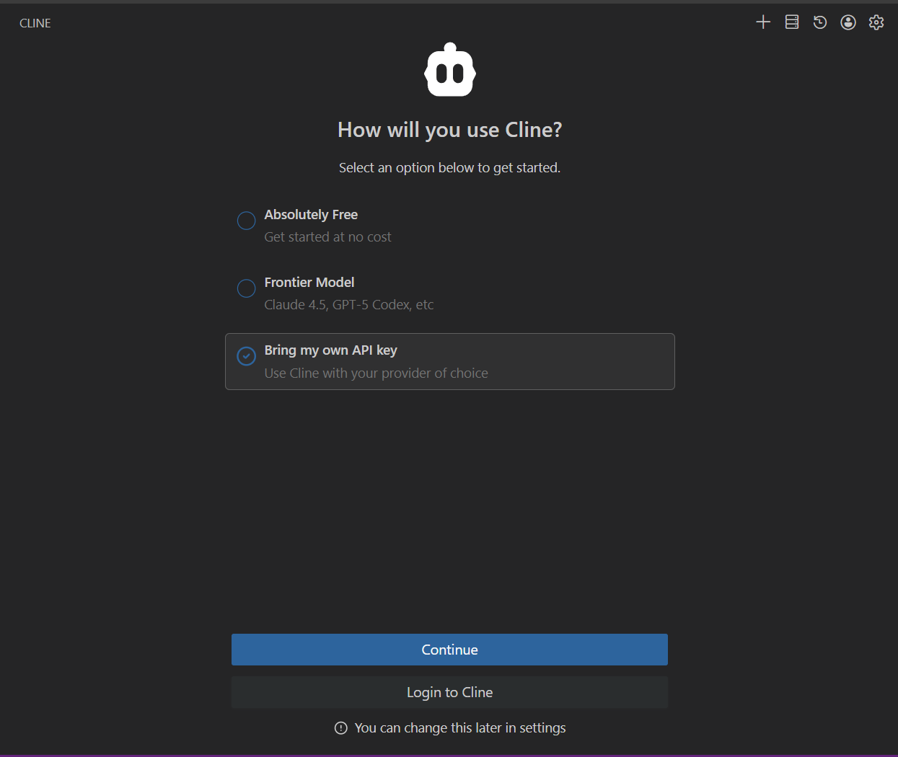

# LLM Gateway ユーザマニュアル

このマニュアルは、AIC（AI・高度プログラミングコンソーシアム）の LLM Gateway サービスの利用者のためのマニュアルです。

ご不明点・ご要望・トラブル等がございましたら、`aic-server-group@keio.jp` までご連絡ください。

## 申請

LLM Gateway のご利用には、事前に利用登録と API キーの発行が必要です。  
ご利用を希望される方は、[こちらのフォーム](https://forms.gle/worZYrwGWnDrr2Vw9) から申請を行ってください。
申請が通り次第、API キーが送付されます。

## アクセス手順

このプロジェクトでは、OpenAI 互換の API を提供しています。
基本的には、OpenAI 互換の API に対応したツールからであれば利用できますが、完全な互換ではないため、一部のツールでは動作しない場合があります。

以下では、VS Code 拡張として Cline、CLI として OpenCode を利用する手順を説明します。

## Cline（VS Code拡張）をご利用の場合

### インストール

1. VS Code の拡張機能を開きます
2. `Cline` を検索してインストールします

### 設定



`Bring my own API key` を選択して、`Continue` をクリックします。

Cline の設定画面を開き、以下の内容で LLM Gateway 用の接続情報を設定してください。

| 項目 | 値 |
| --- | --- |
| API Provider | `LiteLLM` |
| Base URL | `https://llm-gateway.keioaic.dev/v1` |
| API Key | 発行された API キー |
| Model ID | `gpt-oss-120b` |

※ Model ID として，`openai/gpt-oss-120b` ではなく，`gpt-oss-120b` を指定する点にご注意ください。

### 使い方

1. Cline サイドバーを開きます
2. モデルで `gpt-oss-120b` を選びます
3. チャット欄に依頼を入力して利用します

※ 使用料が表示されることがありますが，AIC の LLM Gateway を利用する場合は料金は発生していませんのでご安心ください。

## OpenCode（CLI）をご利用の場合

### インストール

以下のいずれかのコマンドを実行して OpenCode をインストールしてください。

```bash
# macOS / Linux
curl -fsSL https://opencode.ai/install | bash

# Node.js 20+ がインストールされている場合
npm install -g opencode-ai
```

### 設定ファイル

OpenCode は `~/.config/opencode/opencode.json` またはプロジェクト直下の `opencode.json` を読み込みます。
以下の内容で設定ファイルを作成してください。


```json
{
  "$schema": "https://opencode.ai/config.json",
  "provider": {
    "litellm": {
      "npm": "@ai-sdk/openai-compatible",
      "name": "LiteLLM",
      "options": {
        "baseURL": "https://llm-gateway.keioaic.dev/v1",
        "apiKey": "{env:KEIOAIC_LLM_API_KEY}"
      },
      "models": {
        "gpt-oss-120b": {
          "name": "gpt-oss-120b",
          "limit": {
            "context": 32768,
            "output": 8192
          }
        }
      }
    }
  },
  "model": "litellm/gpt-oss-120b"
}
```


### APIキーを設定

シェルの初期化ファイル（例: `~/.bashrc`, `~/.zshrc`）に以下を追加してください。

```bash
export KEIOAIC_LLM_API_KEY=<ここに発行されたAPIキーを貼り付け>
```

設定反映後、シェルを再起動するか `source ~/.bashrc` などで読み直してください。

### 起動方法

以下のコマンドで OpenCode を起動できます。

```bash
opencode
```

## 参考リンク

- Cline OpenAI Compatible: https://docs.cline.bot/provider-config/openai-compatible
- OpenCode 導入: https://opencode.ai/docs/
- OpenCode Config: https://opencode.ai/docs/config/
- OpenCode Providers: https://opencode.ai/docs/providers/
