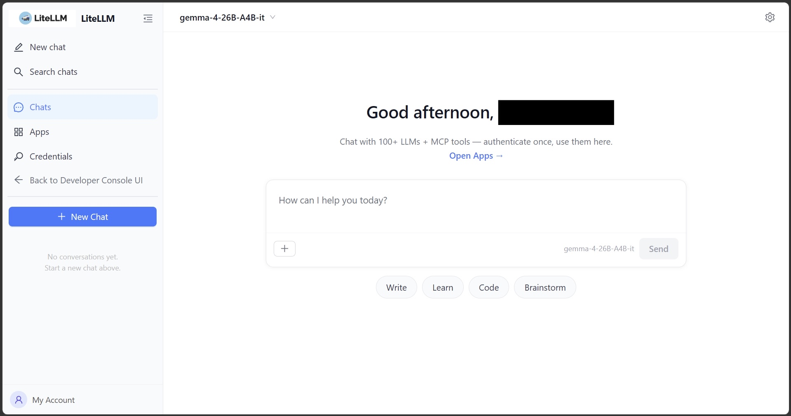

# LLM Gateway ユーザマニュアル

このマニュアルは、AIC（AI・高度プログラミングコンソーシアム）の LLM Gateway サービスの利用者のためのマニュアルです。

ご不明点・ご要望・トラブル等がございましたら、`aic-server-group@keio.jp` までご連絡ください。

## 申請

LLM Gateway のご利用には、事前に利用登録と API キーの発行が必要です。  
ご利用を希望される方は、[こちらのフォーム](https://forms.gle/worZYrwGWnDrr2Vw9) から申請を行ってください。
申請が通り次第、パスワード設定用の URL と API キーが送付されます。
API キーを控え，URL にアクセスしてパスワードを設定してください。

## アクセス手順

このプロジェクトでは、対話形式で利用できる Web UI と OpenAI 互換の API を提供しています。
基本的には、OpenAI 互換の API に対応したツールからであれば利用できますが、完全な互換ではないため、一部のツールでは動作しない場合があります。

以下では、Web UI の利用方法、VS Code 拡張として Cline、CLI として OpenCode を利用する手順を説明します。

## Web UI をご利用の場合

Web UI を利用される場合は https://llm-gateway.keioaic.dev/ui/chat/ にアクセスし，設定したメールアドレスとパスワードでログインしてください。



チャットの履歴はブラウザのローカルストレージに保存されます。

## 使用可能なモデル

使用可能なモデルは `gemma-4-26B-A4B`, `gpt-oss-120` などがありますが、これらは予告なく変更される可能性があります。

使用可能なモデルの一覧は、以下のコマンドで確認できます。

`curl https://llm-gateway.keioaic.dev/v1/models -H "Authorization: Bearer $KEIOAIC_LLM_API_KEY"`

※ API キーは、申請後に送付されるメールに記載されたものを使用してください。

## Cline（VS Code拡張）をご利用の場合

### インストール

1. VS Code の拡張機能を開きます
2. `Cline` を検索してインストールします

### 設定


`Bring my own API key` を選択して、`Continue` をクリックします。

Cline の設定画面を開き、以下の内容で LLM Gateway 用の接続情報を設定してください。

| 項目 | 値 |
| --- | --- |
| API Provider | `LiteLLM` |
| Base URL | `https://llm-gateway.keioaic.dev/v1` |
| API Key | 発行された API キー |
| Model ID | `gemma-4-26B-A4B` |

※ Model ID として，`openai/gemma-4-26B-A4B` ではなく，`gemma-4-26B-A4B` を指定する点にご注意ください。

### 使い方

1. Cline サイドバーを開きます
2. モデルで `gemma-4-26B-A4B` を選びます
3. チャット欄に依頼を入力して利用します

※ 使用料が表示されることがありますが，AIC の LLM Gateway を利用する場合は料金は発生していませんのでご安心ください。

## OpenCode（CLI）をご利用の場合

### インストール

以下のいずれかのコマンドを実行して OpenCode をインストールしてください。

```bash
# macOS / Linux
curl -fsSL https://opencode.ai/install | bash

# Node.js 20+ がインストールされている場合
npm install -g opencode-ai
```

### 設定ファイル

OpenCode は `~/.config/opencode/opencode.json` またはプロジェクト直下の `opencode.json` を読み込みます。
以下の内容で設定ファイルを作成してください。


```json
{
    "$schema": "https://opencode.ai/config.json",
    "provider": {
        "litellm": {
            "npm": "@ai-sdk/openai-compatible",
            "name": "LiteLLM",
            "options": {
                "baseURL": "https://llm-gateway.keioaic.dev/v1",
                "apiKey": "{env:KEIOAIC_LLM_API_KEY}"
            },
            "models": {
                "gemma-4-26B-A4B-it": {
                    "name": "gemma-4-26B-A4B-it",
                    "limit": {
                        "context": 131072,
                        "output": 16384
                    }
                }
            }
        }
    },
    "model": "litellm/gemma-4-26B-A4B-it"
}
```


### APIキーを設定

シェルの初期化ファイル（例: `~/.bashrc`, `~/.zshrc`）に以下を追加してください。

```bash
export KEIOAIC_LLM_API_KEY=<ここに発行されたAPIキーを貼り付け>
```

設定反映後、シェルを再起動するか `source ~/.bashrc` などで読み直してください。

### 起動方法

以下のコマンドで OpenCode を起動できます。

```bash
opencode
```

## 禁止事項

- 学習・研究活動から逸脱した目的でのサーバリソース使用を禁じます。
- アカウント、APIキー等の認証情報を第三者に共有すること、または第三者になりすまして利用することを禁じます。
- サービスの安定運用を妨げる行為を禁じます。
- 法令または公序良俗に反する利用、または他者の権利・安全を侵害する利用を禁じます。
- 上記の行為が発覚した場合は、事前に警告を行うことなく直ちにアカウントを停止いたします。

## 参考リンク

- Cline OpenAI Compatible: https://docs.cline.bot/provider-config/openai-compatible
- OpenCode 導入: https://opencode.ai/docs/
- OpenCode Config: https://opencode.ai/docs/config/
- OpenCode Providers: https://opencode.ai/docs/providers/
